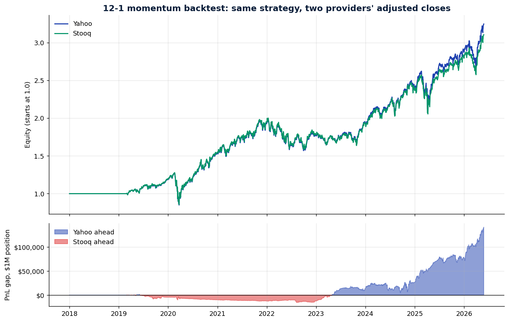
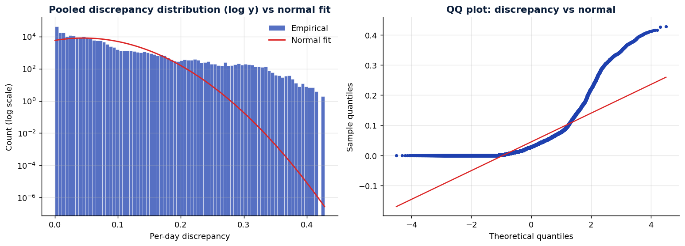
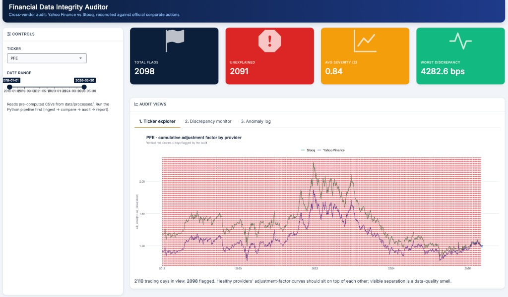
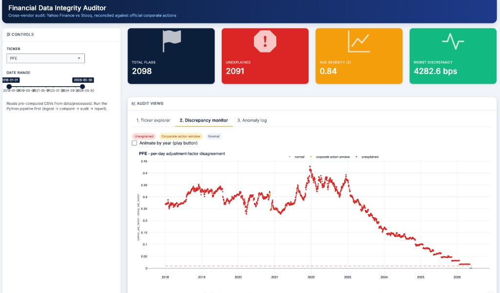
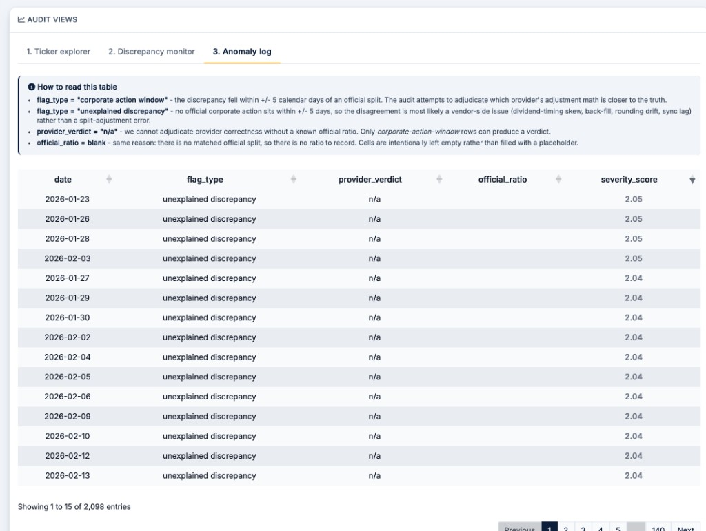

# Financial Data Integrity Auditor

A reproducible pipeline that cross-validates two independent providers
of daily adjusted equity prices, flags disagreements, reconciles them
against the official corporate-action calendar, and **quantifies the
strategy-level cost** of vendor disagreement on a real trading signal.

> **The problem.** Silently incorrect adjusted-close data corrupts
> every downstream calculation: backtests, factor exposures, risk
> models, PnL attribution. Most teams don't notice because each
> vendor's daily price looks "correct" in isolation — the
> disagreement only shows up cumulatively.

---

## Headline numbers — S&P 100, 2018-01-01 → 2026-05-26

| Metric | Value |
|---|---|
| Ticker-days observed | **206,567** (98 tickers × ~2,110 days) |
| Total flagged days | **148,845** |
| Worst single-ticker cumulative disagreement | **PFE — 42.8%** |
| Same-strategy Sharpe gap (Yahoo − Stooq) | **+0.034** |
| Same-strategy cumulative PnL gap on $1M | **+$141,565** |
| Pooled excess kurtosis of the discrepancy series | **7.48** (heavily fat-tailed) |
| Anomalies caught: z-score vs MAD detector | **5,394 vs 14,432** |

---

## What it found

### 1. The disagreement is methodology, not error

Yahoo and Stooq each use a different industry-standard dividend-
adjustment convention. Zero-dividend names (AMZN, GOOG, META) agree
to within **1 basis point**. High-yield names (PFE, KHC, MO) diverge
cumulatively — by ~40% over 8 years on PFE. Both vendors are
individually correct; they just answer different questions.

### 2. Identical strategy → different headline numbers

A 12-1 momentum signal run on each provider's adjusted-close panel,
same universe, same window, same code:



| Provider | Total return | Sharpe | Max drawdown |
|---|---|---|---|
| **Yahoo** (subtractive)    | 224.8% | **0.794** | -33.4% |
| **Stooq** (multiplicative) | 210.7% | **0.760** | -33.1% |

Same code, different vendor — **$141K PnL gap per $1M** of capital.

### 3. The 3σ rule is hiding outliers

The discrepancy distribution has pooled excess kurtosis **7.48** —
heavily fat-tailed:



A z-score detector lets the few extreme outliers inflate σ until
everything else looks "in spec". A MAD-based detector catches
**2.7× more anomalies** (14,432 vs 5,394) at the same nominal
threshold. For production use, MAD is the defensible choice.

---

## Dashboard

Three interactive panels in an R Shiny app. Reads only from
`data/processed/` — no provider API calls.

```bash
Rscript -e "shiny::runApp('dashboard/app.R', port=4848, launch.browser=TRUE)"
```

> **Note:** the repo ships with the two case-study tickers (AMZN, PFE)
> already populated in `data/processed/` so the dashboard runs out of
> the box for those names. To populate the full S&P 100 ticker
> dropdown, run the pipeline first with `--universe sp100` (see
> *Quickstart* below).

### Panel 1 — Ticker explorer

Overlaid adjustment-factor curves for both providers, with flagged
days marked. PFE shown — a >5% yield stock — where the two curves
visibly separate. Top KPI tiles summarize the ticker.



### Panel 2 — Discrepancy monitor

Per-day disagreement as an interactive Plotly time series. Colored
by flag type (red = unexplained, amber = corporate-action window,
gray = normal). Dashed red line marks the 1% threshold.



### Panel 3 — Anomaly log

Sortable, color-coded incident table. Built-in explainer makes the
schema self-documenting for stakeholders who haven't read the code.



---

## How it works

A four-stage pipeline. Each stage writes to `data/` and reads from
the previous stage's output, so the pipeline is fully resumable.

```
   ingest    →   compare   →    audit    →   report
(Yahoo+Stooq    (factors,    (corp-action   (master
 raw CSVs)       z, flags)    reconcile)    audit table)
```

Plus two analytical modules that run on the same outputs:

- **`backtest_impact`** — runs 12-1 momentum on each provider's panel
  and reports the Sharpe / PnL gap.
- **`stats_diagnostics`** — distribution moments, QQ plot, and detector
  comparison (z-score vs MAD vs Tukey IQR).

**Flag rule.** A trading day is flagged if `|z| > 3` OR raw
disagreement > 1%. Each flag is then matched against the official
Yahoo split calendar within ±5 calendar days and classified as
**corporate-action window** (explainable) or **unexplained
discrepancy** (likely data-quality issue).

---

## Tech stack

`Python` (pandas, scipy, yfinance) · `R` (Shiny, bslib, plotly) · `pytest` · `GitHub Actions` · `Git`

---

## Quickstart

### Setup

```bash
python -m venv .venv && source .venv/bin/activate
pip install -r requirements.txt
echo "STOOQ_API_KEY=<your key>" > .env       # see "Stooq key" below
```

For the dashboard:

```r
install.packages(c("shiny", "bslib", "ggplot2", "DT", "dplyr",
                   "readr", "plotly", "shinycssloaders", "shinyjs",
                   "htmltools", "scales", "bsicons"))
```

### Run the basket (5 tickers, ~20 seconds)

```bash
python -m src.ingest && python -m src.compare && \
python -m src.audit  && python -m src.report
```

### Run the full S&P 100 (~4 min ingest)

```bash
python -m src.ingest          --universe sp100 && \
python -m src.compare         --universe sp100 && \
python -m src.audit           --universe sp100 && \
python -m src.report          --universe sp100 && \
python -m src.backtest_impact   --universe sp100 && \
python -m src.stats_diagnostics --universe sp100
```

### Launch the dashboard

```bash
Rscript -e "shiny::runApp('dashboard/app.R', port=4848, launch.browser=TRUE)"
```

### Run the tests

```bash
pytest tests/ -v       # 8 deterministic tests, no API calls
```

### Stooq key

Stooq's free CSV endpoint is gated by a one-time captcha (no email,
no rate limit on the resulting key):

1. Open <https://stooq.com/q/d/?s=aapl.us>.
2. Click the blue **▼ Download data in csv file…** link.
3. Solve the captcha → click **Approve**.
4. Right-click the new **Download file…** link → **Copy link
   address**. Extract `apikey=<your_key>` from the URL.
5. Put `STOOQ_API_KEY=<your_key>` in your `.env`.

---

## Project layout

```
financial-data-auditor/
├── src/
│   ├── ingest.py              # Yahoo + Stooq raw CSVs
│   ├── compare.py             # adjustment factors, z-score, flags
│   ├── audit.py               # corporate-action reconciliation
│   ├── report.py              # master audit table
│   ├── backtest_impact.py     # 12-1 momentum, both providers
│   └── stats_diagnostics.py   # distribution + detector comparison
├── dashboard/app.R            # R Shiny dashboard
├── notebooks/audit_report.ipynb
├── data/
│   ├── raw/                   # provider CSVs
│   ├── processed/             # comparisons, audits, master_audit.csv
│   └── splits/                # official split calendar
├── docs/                      # charts + dashboard screenshots
├── tests/test_compare.py      # 8 unit tests
├── .github/workflows/ci.yml   # pytest on Python 3.10
└── requirements.txt
```

---

## Production notes

This audit is single-run by design. Taking it to production would
involve:

- **Daily, post-close cadence.** Schedule the six stages as a single
  DAG (Airflow / Prefect / Dagster). Persist outputs to a versioned
  store (S3 + dvc, Delta Lake, columnar warehouse).
- **Page on signal, not methodology drift.** Suppress the dividend-
  convention background on known high-yield tickers; page only on
  (a) corporate-action-window flags with non-ambiguous verdicts, or
  (b) MAD-rule flags on zero-dividend tickers (where any disagreement
  is unambiguously a data error).
- **Add a third independent source.** Tiingo is already wired in as
  an optional provider (set `TIINGO_API_KEY` in `.env`). With three
  providers the audit moves from "two disagree" to "majority rules".
- **Treat both providers as untrusted by default.** The official
  corporate-actions feed is the only source of truth; flagged days
  that align with a known event get one adjudication path, flagged
  days that don't get a different one.
- **Backtest-impact monitoring.** Track the cross-provider PnL gap
  as a first-class metric. A sudden jump after a vendor data refresh
  is a leading indicator of an upstream methodology change.
